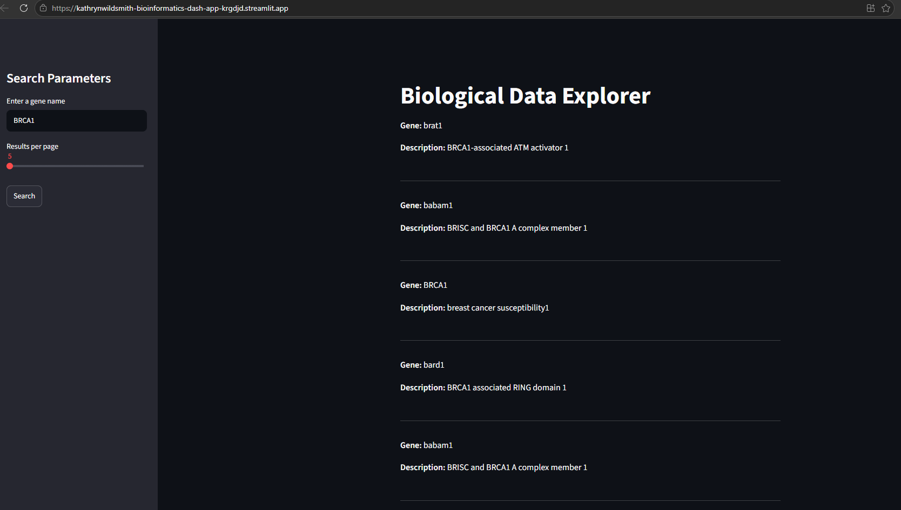

# Bioinformatics_Dash

---
### Preview

---
A web-based dashboard designed to interface with the NCBI E-utilities API, allowing researchers to efficiently search, explore, and retrieve biological data. This application streamlines the process of querying the NCBI database by handling API request chaining, pagination, and data transformation in a clean, user-friendly interface.

# Key Features 
API Chaining Architecture: Seamlessly automates multi-step API workflows, performing an esearch to retrieve IDs, followed by an esummary to fetch detailed metadata, significantly reducing manual lookup time.

Optimized UX/UI: Leverages the Streamlit framework to provide a responsive interface featuring sidebar controls, interactive sliders, and clear metrics.

Robust Error Handling: Implements resilient logic to manage network requests and API rate limits (HTTP 429), ensuring the application remains stable and reliable for end-users.

Scalable Pagination: Allows users to navigate large datasets through intuitive "Next/Previous" controls, preventing browser overload by managing data loads effectively.

# Technologies Used
Python: The core logic language.

Streamlit: For building the interactive, front-end dashboard.

Requests: For handling API communication and session management.

NCBI E-utilities API: The primary data source for gene/biological information.
